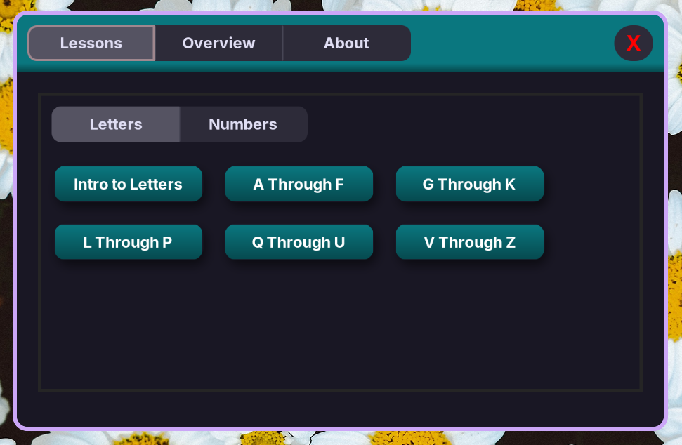

# Disclaimer
I am not an ASL expert! If you are trying to learn ASL, you probably shouldn't use this app. I created this app as a way for me to practice my coding and ASL skills, I am NOT qualified to be teaching ASL.

# Learn-ASL
Learn-ASL is an app for learning fingerspelling in American Sign Language. It splits the learning process up into bite sized pieces, by teaching you 5* characters at a time.

[Demo video](https://www.youtube.com/watch?v=qXAb-XMiNj4) (I made this for Siege)


*Not always 5 at a time, just usually.

## Features:
 - Teaches you how to fingerspell in ASL!
 - Has illustrations and descriptions to make it clear how it works.
 - Is split into 2 categories, letters and numbers!
 - It's written in python, and uses GTK... So that's cool I guess.
 - Practice mode, which shows you a random letter and you have to figure out which it is!

## Unfinished/Todos:
 - Letters tab needs to be finished.
 - Numbers tab has barely been started, needs lots of work!
 - Maybe a button to switch between dark and light modes coming soon?
 - Add a welcome screen that shows up the first time you open the app.

## How to install:
Make sure you have these packages installed on your system: GTK, PyGObject and LibAdwaita. Then clone this repository, and, from within the repository's main folder, execute ```python3 LearnASL.py```.
